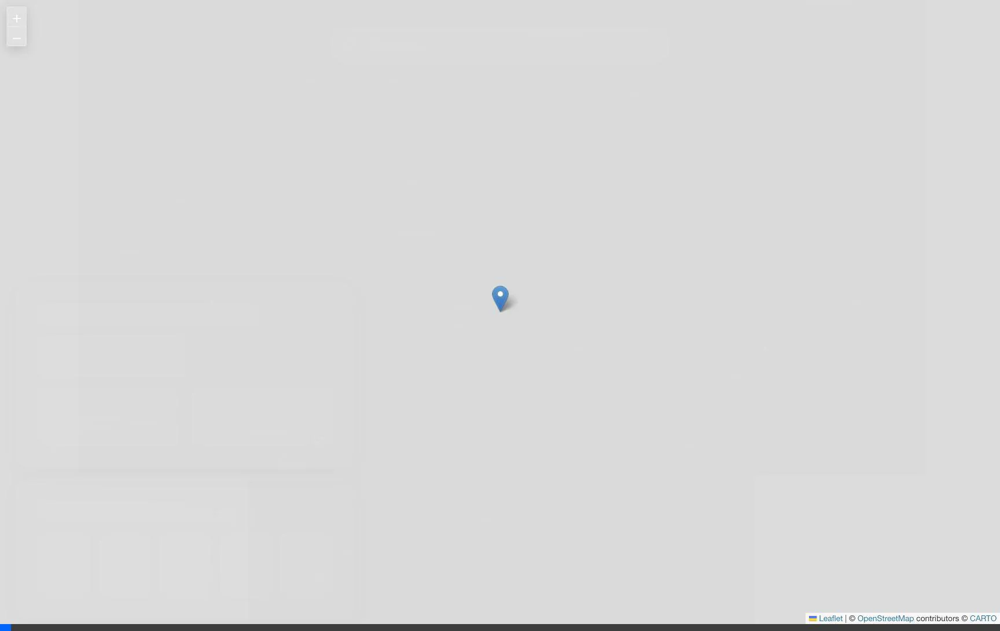

# WeatherScope - Interactive Weather Map 🌤️

WeatherScope is a modern, interactive weather application that allows users to explore weather conditions globally. It features a dynamic map interface with intelligent zooming, precise boundary visualization, and real-time weather data.

## 🎬 Demo

Check out WeatherScope in action:

### 1. Search: Bengaluru
*(Demonstrates search, map interaction, dynamic zoom, and precise boundary visualization)*


### 2. Search: New York
*(Demonstrates international search capability and boundary rendering)*


## ✨ Features

- **Interactive Map**: Built with Leaflet, featuring dark mode tiles and smooth animations.
- **Intelligent Search**: Search for any city, town, or village worldwide.
- **Dynamic Zoom**: Automatically adjusts zoom level based on the location type (City vs. Country) and population.
- **Precise Boundaries**: Visualizes the exact political/administrative boundaries of selected locations using GeoJSON polygons.
- **Real-time Weather**: Displays current temperature, wind speed, humidity, and weather conditions.
- **5-Day Forecast**: Provides a quick outlook for the week ahead.
- **Smart Location Naming**: Reverse geocoding prioritizes meaningful place names over raw road numbers.

## 🛠️ Tech Stack

- **Frontend**: React, Vite
- **Map Engine**: React-Leaflet, Leaflet
- **Styling**: CSS3, Glassmorphism design
- **APIs**:
  - **Open-Meteo**: Weather data and Geocoding
  - **Nominatim (OpenStreetMap)**: Boundary data (GeoJSON) and Reverse Geocoding

## 🚀 Getting Started

Follow these steps to run the project locally:

1.  **Clone the repository** (if applicable) or navigate to the project directory.

2.  **Install dependencies**:
    ```bash
    npm install
    ```

3.  **Start the development server**:
    ```bash
    npm run dev
    ```

4.  **Open the app**:
    Open your browser and navigate to `http://localhost:5173`.

## 📚 Documentation

The `docs/` folder contains detailed information about the project and its development:

- **[ANTIGRAVITY_DOCS.md](docs/ANTIGRAVITY_DOCS.md)**: A comprehensive guide to Antigravity, the AI agent that built this project. It covers the ecosystem, features, and comparison with traditional tools.
- **[DEVELOPMENT_LOG.md](docs/DEVELOPMENT_LOG.md)**: A chronological log of the development session, including the pivot from a Todo app to a Weather app, metrics, and "behind the scenes" stories.


---
Generated by Antigravity 🚀
